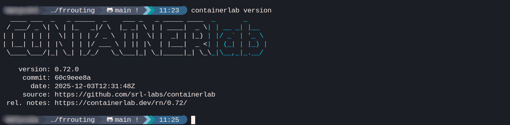

# FRROUTING NETWORKING LAB
> Structured networking scenarios practice using **FRRouting** and **Containerlab**.

---

### Core Concepts
*   **Layer 3:** IPv4 subnetting, gateway redundancy, static routing.
*   **Dynamic routing:** OSPFv2 (single and multi-area).
*   **Network security:** Access Control Lists (ACL) and stateful NAT.
*   **Infrastructure as Code:** Automated topology deployment with Containerlab.

---

### Lab Portfolio
1.  **[Lab 01: static routing](./lab01-static-routing)** - Manual route configuration between multiple hops.
2.  **[Lab 02: connected routes](./lab02-connected-routes)** - Analysis of routing table population and basic IP forwarding.
3.  **[Lab 03: OSPF multiple areas + NAT](./lab03-ospf-multiple-areas+nat)** - Scaling networks with OSPF areas and implementing NAT for edge connectivity.

---

### Workflow
Each lab directory contains:
*   `lab.clab.yml`: Topology definition (nodes, links, images).
*   `README.md`: Objectives, concepts, and verification steps.
*   `configs/`: FRR configuration files (`frr.conf`).
*   `diagrams/`: Visual representation of the network.
*   `scripts/`: Simple bash scripts to automate the deployment and cleanup of the lab.
*   `screenshots/`: Screenshots of the commands and outputs.

---

### Prerequisites and setup

Before running any lab, ensure you have **Containerlab** and a container runtime installed. Containerlab orchestrates the networking nodes, but it depends on a runtime to manage the actual containers.

Watch this video to get familiar with **Containerlab** and see how it simplifies network labs:

[](https://www.youtube.com/watch?v=XdshvUqysRc)

#### 1. Install container runtime
You can use either **Docker** or **Podman**. Docker is the standard choice, but I use **Podman** on my Fedora machine, so the installation looks a bit different in my case. Here are both options:

**Docker installation**
```bash
# Run the official installation script
curl -fsSL https://get.docker.com -o get-docker.sh
sudo sh get-docker.sh

# Enable and start the service
sudo systemctl enable --now docker
```

**Podman installation (alternative)**
```bash
# On Debian/Ubuntu:
sudo apt update
sudo apt-get -y install podman
sudo systemctl enable --now podman

# On Redhat/Fedora:
sudo dnf install -y podman
sudo systemctl enable --now podman
```

#### 2. Install Containerlab
After installing the runtime, install **Containerlab**:
```bash
curl -sL https://containerlab.dev/setup | sudo bash -s installer
```

> **Note for Podman users:**
> When using Podman, you must specify the runtime with the `--runtime podman` flag for all commands:
> ```bash
> sudo containerlab deploy --runtime podman -t lab.clab.yml
> sudo containerlab destroy --runtime podman -t lab.clab.yml
> ```

#### 3. System Requirements and Dependencies
*   **Linux kernel:** Requires a modern Linux kernel with support for namespaces, cgroups, and veth pairs.
*   **Network tools:** Some labs may require `bridge-utils` or `iproute2` on the host.
*   **Permissions:** Commands for deploying topologies usually require `sudo` privileges.

#### 4. Verification
After installation completes, verify it by checking the version:
```bash
containerlab --version
```
