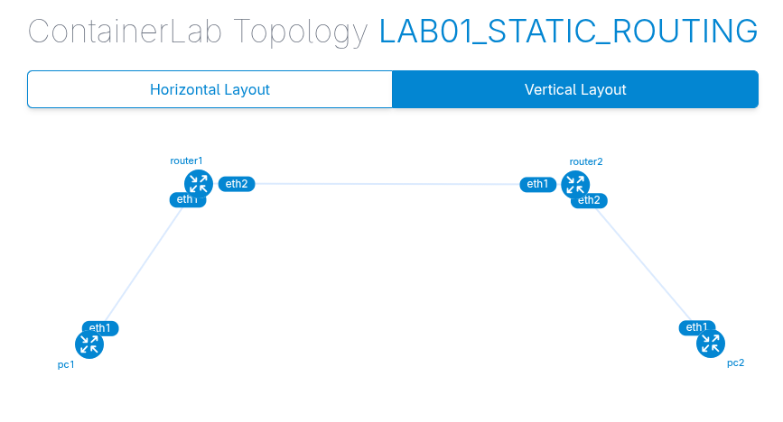
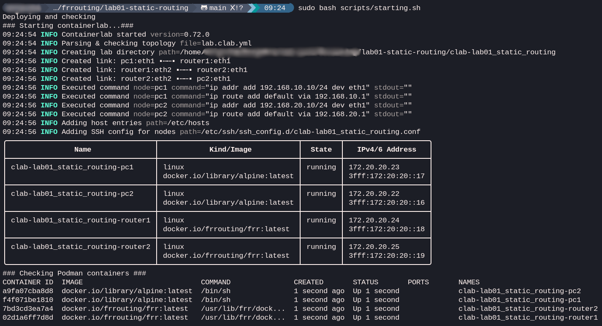
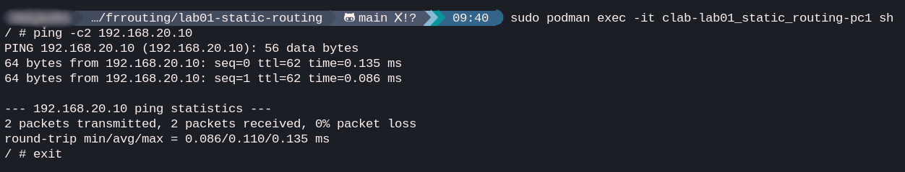
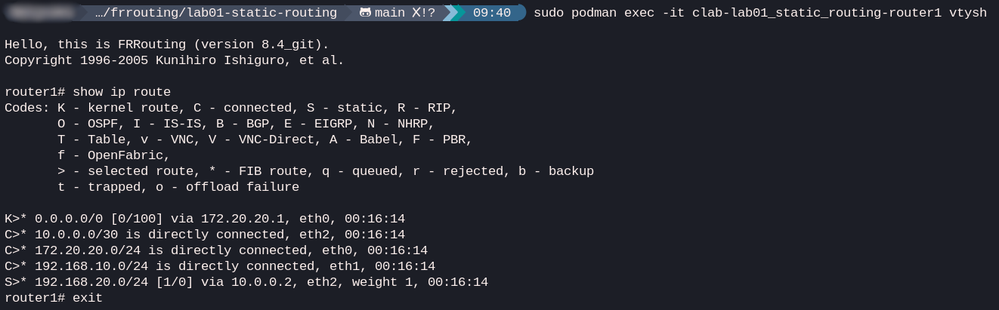
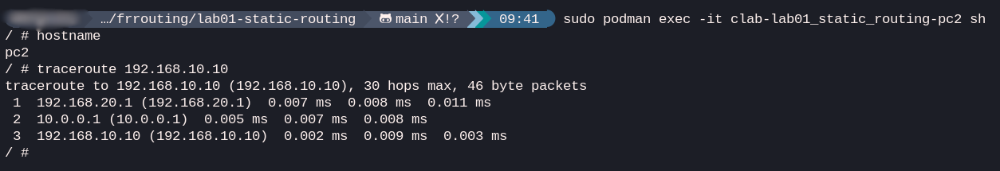

# Lab 01: Static Routing

## Goal
Establish connectivity between two hosts (PC1 and PC2) separated by two routers using manual static routes.

## Topology


## Concepts
- IP addressing (subnetting /24 for point-to-point)
- Static routes (`ip route`)
- IP forwarding in Linux
- Connectivity verification (ping, traceroute)

## IP plan
| Node | Interface | IP Address |
| :--- | :--- | :--- |
| **PC1** | eth1 | 192.168.10.10/24 (GW: 192.168.10.1) |
| **Router1** | eth1 | 192.168.10.1/24 |
| **Router1** | eth2 | 10.0.0.1/30 |
| **Router2** | eth1 | 10.0.0.2/30 |
| **Router2** | eth2 | 192.168.20.1/24 |
| **PC2** | eth1 | 192.168.20.10/24 (GW: 192.168.20.1) |

## Lab Execution
**Running first script**:
   ```bash
   ./scripts/starting.sh
   ```
   This script deploys the topology and shows the status of the containers.
   
   

## Verification

### 1. Ping from PC1 to PC2
This is to verify end-to-end connectivity by pinging PC2 from PC1.
```bash
# pc1
ping 192.168.20.10
```


### 2. Inspect routing table on R1
Connectivity between two PCs is possible because of the static routes configured on Router 1, which shows this output:
```bash
# router1
show ip route
```


### 3. Trace path from PC1
From the other side we can use `traceroute` to confirm that packets are traversing both routers.
```bash
# pc1
traceroute 192.168.20.10
```


## Destroying the lab
**Running second script**:
```bash
./scripts/destroying.sh
```
The script removes the `clab` directory and destroys the environment.