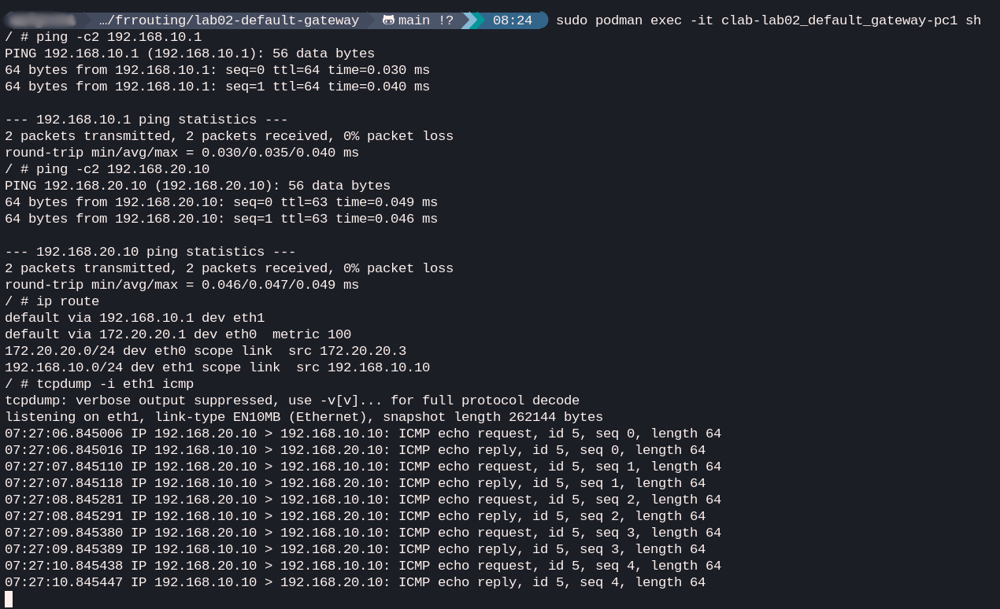
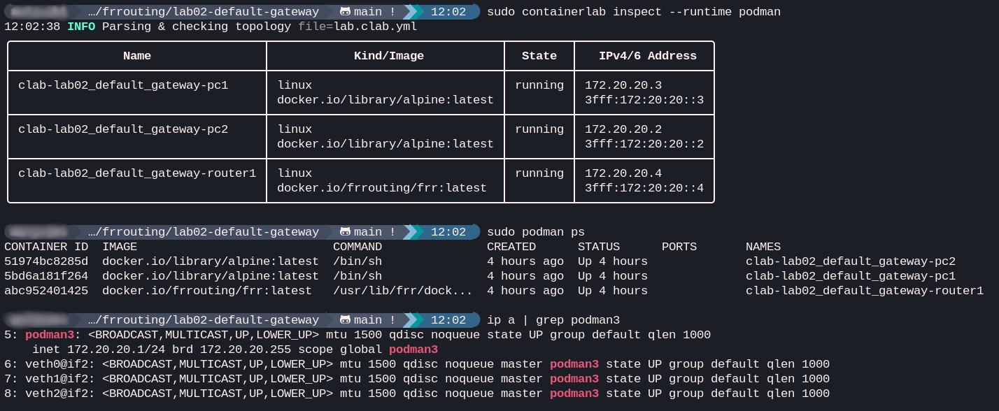

# Lab 02: default gateway

## Goal
This lab shows how to configure and verify a default gateway on a host and how it communicates with devices outside its local IP subnet. It also demonstrates Containerlab's ability to automatically configure IP addresses and gateways on the nodes. All very fast and possible on one PC, VM or laptop.

## Topology
**PC1** -- **eth1-Router1-eth2** -- **PC2**

## Concepts
- local vs remote network communication
- default gateway (GW) configuration on hosts
- router as a transition point between subnets
- ARP resolution and ICMP (ping)

## IP plan
| Node | Interface | IP Address | Gateway |
| :--- | :--- | :--- | :--- |
| **PC1** | eth1 | 192.168.10.10/24 | 192.168.10.1 |
| **Router1** | eth1 | 192.168.10.1/24 | N/A |
| **Router1** | eth2 | 192.168.20.1/24 | N/A |
| **PC2** | eth1 | 192.168.20.10/24 | 192.168.20.1 |

## Verification
1. Ping from PC1 to its gateway: `ping 192.168.10.1`
2. Ping from PC1 to PC2 (remote network): `ping 192.168.20.10`
3. View the routing table on PC1: `ip route`
4. Observe ICMP traffic on Router1: `tcpdump -i eth1 icmp`

### Verification results

On the screenshot above, I performed the following verification steps on **PC1**:
1. **Connectivity to gateway:** my successful ping to `192.168.10.1` confirms that the local link to the router is functional.
2. **Connectivity to remote network:** my successful ping to `192.168.20.10` (PC2) proves that the traffic is correctly reaching the other subnet through the default gateway.
3. **Routing table inspection:** my `ip route` command shows that the `default via 192.168.10.1 dev eth1` route is properly installed, directing all non-local traffic to the router.
4. **Traffic capture:** my `tcpdump` output shows incoming ICMP echo requests from `192.168.20.10` (PC2) and outgoing echo replies from **PC1**, confirming successful end-to-end communication.

### Lab overview

Here we see how Podman is used as a runtime for Containerlab:

1. **Topology status:** the `containerlab inspect` command confirms that all three nodes (pc1, pc2, and router1) are running and have their management IPv4/IPv6 addresses assigned.
2. **Container runtime:** the `podman ps` command shows the actual containers that Podman manages, matching the topology nodes.
3. **Internal networking:** the `ip a` output reveals the `podman3` bridge interface and its virtual ethernet (veth) pairs. This shows how my host operating system bridges the traffic between the containers in this lab environment.
