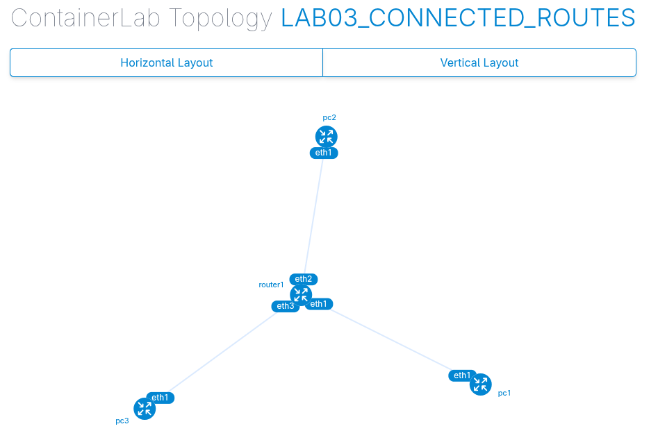
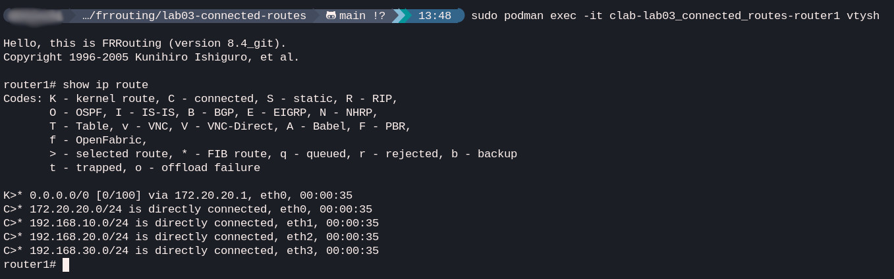
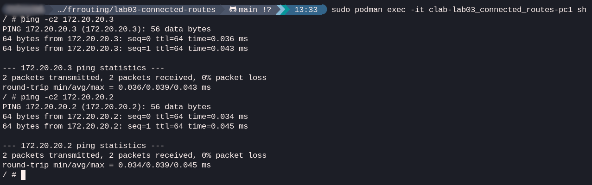

# Lab 03: connected routes

## Goal
To analyze how a routing table is populated with directly connected routes as soon as IP addresses are assigned to interfaces. This lab demonstrates that a router automatically knows about networks it is physically and logically (IP) a part of. To utilize Containerlab's ability to automatically configure IP addresses and gateways on the nodes.

## Topology
**PC1** (192.168.10.10) <---> **eth1-Router1-eth2** <---> **PC2** (192.168.20.10)
&nbsp;&nbsp;&nbsp;&nbsp;&nbsp;&nbsp;&nbsp;&nbsp;&nbsp;&nbsp;&nbsp;&nbsp;&nbsp;&nbsp;&nbsp;&nbsp;&nbsp;&nbsp;&nbsp;&nbsp;&nbsp;&nbsp;&nbsp;&nbsp;&nbsp;&nbsp;&nbsp;&nbsp;&nbsp;&nbsp;&nbsp;&nbsp;&nbsp;&nbsp;&nbsp;&nbsp;&nbsp;&nbsp;|  
&nbsp;&nbsp;&nbsp;&nbsp;&nbsp;&nbsp;&nbsp;&nbsp;&nbsp;&nbsp;&nbsp;&nbsp;&nbsp;&nbsp;&nbsp;&nbsp;&nbsp;&nbsp;&nbsp;&nbsp;&nbsp;&nbsp;&nbsp;&nbsp;&nbsp;&nbsp;&nbsp;&nbsp;&nbsp;&nbsp;&nbsp;&nbsp;**eth3**  
&nbsp;&nbsp;&nbsp;&nbsp;&nbsp;&nbsp;&nbsp;&nbsp;&nbsp;&nbsp;&nbsp;&nbsp;&nbsp;&nbsp;&nbsp;&nbsp;&nbsp;&nbsp;&nbsp;&nbsp;&nbsp;&nbsp;&nbsp;&nbsp;&nbsp;&nbsp;&nbsp;&nbsp;&nbsp;&nbsp;&nbsp;&nbsp;&nbsp;&nbsp;&nbsp;&nbsp;&nbsp;&nbsp;|  
&nbsp;&nbsp;&nbsp;&nbsp;&nbsp;&nbsp;&nbsp;&nbsp;&nbsp;&nbsp;&nbsp;&nbsp;&nbsp;&nbsp;&nbsp;&nbsp;&nbsp;&nbsp;&nbsp;&nbsp;&nbsp;&nbsp;&nbsp;&nbsp;&nbsp;&nbsp;&nbsp;&nbsp;&nbsp;&nbsp;&nbsp;&nbsp;**PC3** (192.168.30.10)

### Topology Diagram
To get a better visual overview, Containerlab can generate a dynamic topology diagram using Containerlab's built-in graphing tool. This is done by running the following command in the lab directory:

```bash
sudo containerlab graph -t lab.clab.yml
```



The diagram shows **Router1** as the central node connecting **PC1**, **PC2**, and **PC3**, which helps in visualizing the three distinct subnets I'm working with.

## Concepts
- **Directly connected routes:** Routes that are automatically added to the routing table when an interface is configured with an IP address and is in the 'up' state.
- **Routing table analysis:** Identifying route types (Type 'C' for connected in FRR).
- **Basic IP forwarding:** How the router uses these connected routes to bridge traffic between different subnets.

## IP plan
| Node | Interface | IP Address | Gateway |
| :--- | :--- | :--- | :--- |
| **PC1** | eth1 | 192.168.10.10/24 | 192.168.10.1 |
| **Router1** | eth1 | 192.168.10.1/24 | N/A |
| **Router1** | eth2 | 192.168.20.1/24 | N/A |
| **Router1** | eth3 | 192.168.30.1/24 | N/A |
| **PC2** | eth1 | 192.168.20.10/24 | 192.168.20.1 |
| **PC3** | eth1 | 192.168.30.10/24 | 192.168.30.1 |

## Verification
1. **Routing table inspection:** on **Router1**, I use 'vtysh` to enter the router CLI and then 'show ip route' to see the connected routes.
2. **Connectivity tests:** From **PC1**, let's ping both **PC2** and **PC3**. Containerlab has automatically configured the IP addresses and gateways on the PCs during deployment.
   - `ping 192.168.20.10`
   - `ping 192.168.30.10`

### Verification results

After setting up the lab, this is how to verify the routing table on **Router1**. As expected, the router automatically added connected routes for all three networks once the interfaces were brought up with their respective IP addresses.



Be sure and check connectivity from **PC1** to **PC2** and **PC3**. The pings were successful, which confirms that **Router1** is correctly forwarding traffic between these directly connected subnets.


