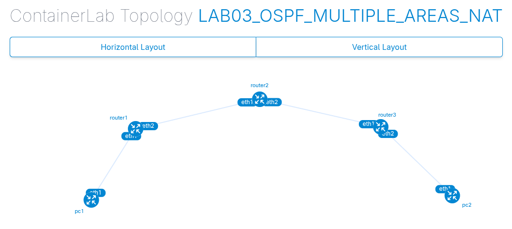
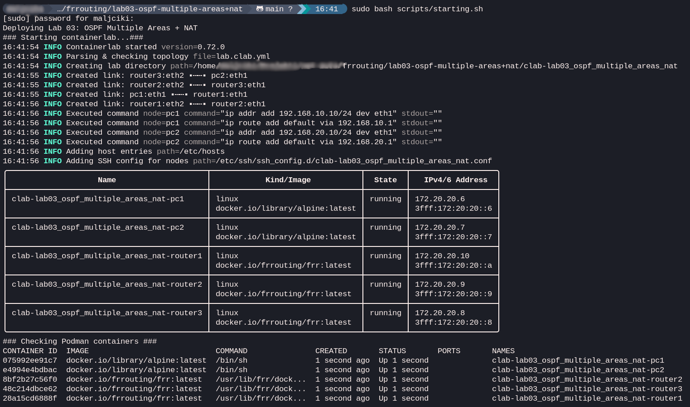
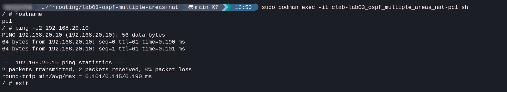
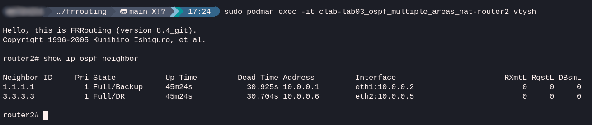
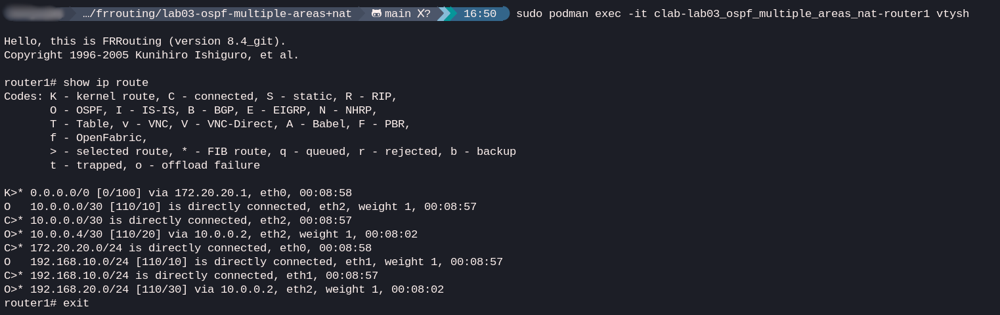

# Lab 03: OSPF Multiple Areas

## Goal
The goal of this lab is to configure **Multi-area OSPFv2**. It demonstrates how OSPF uses areas to scale networks, specifically focusing on the role of an **Area Border Router (ABR)** that connects the backbone (Area 0) with a non-backbone area (Area 1).

## Topology
**PC1** (Area 0) --- **R1** (Area 0) --- **R2** (ABR: Area 0/1) --- **R3** (Area 1) --- **PC2** (Area 1)

## Concepts
- **Backbone Area (Area 0):** The core area that all other areas must connect to.
- **Area Border Router (ABR):** A router that has interfaces in multiple areas. Its job is to summarize topology information between areas.
- **Inter-Area Routes:** Routes learned from other areas (noted with 'O IA' in the routing table).
- **LSA Type 3 (Summary LSA):** How ABRs share network information between areas.

## IP plan
| Node | Interface | IP Address | OSPF Area |
| :--- | :--- | :--- | :--- |
| **PC1** | eth1 | 192.168.10.10/24 | N/A (Host) |
| **Router1** | eth1 | 192.168.10.1/24 | Area 0 |
| **Router1** | eth2 | 10.0.0.1/30 | Area 0 |
| **Router2** | eth1 | 10.0.0.2/30 | Area 0 |
| **Router2** | eth2 | 10.0.0.5/30 | Area 1 |
| **Router3** | eth1 | 10.0.0.6/30 | Area 1 |
| **Router3** | eth2 | 192.168.20.1/24 | Area 1 |
| **PC2** | eth1 | 192.168.20.10/24 | N/A (Host) |

## Clab deployment
Running script `./scripts/starting.sh` will deploy the lab.

## Verification
1. **Connectivity test:** From **PC1**, ping **PC2**: `ping 192.168.20.10`

2. **Verify OSPF neighbors:** On **Router2**, check OSPF neighbor status on both interfaces: `show ip ospf neighbor`

3. **Analyze Routing Table:** On **Router1**, look for "Inter-Area" routes: `show ip route`. Lines starting with `O` belong to OSPF. To remove other protocols from the output simply use `show ip route ospf`.

4. **LSA Inspection:** On **Router1**, check for LSAs generated by the ABR: `show ip ospf database summary`

5. **Connectivity and path**
A final traceroute from **PC2** to **PC1** confirms that traffic is successfully navigating through Area 0, across the ABR, and through Area 1 to reach its destination.

## Other useful OSPF commands
- `show ip ospf database`: **Area map**. All routers in the same Area see the same database of information, which they use to calculate the best paths.
- `show ip ospf interface`: **Interface check**. Shows if OSPF is active on a specific interface (e.g., `eth1`) and how it's behaving there.
- `show ip ospf`: **OSPF health record**. General information about who you are in the OSPF world (Router ID) and which areas you are serving.

## Clab cleanup
Running script `./scripts/destroying.sh` will remove the lab.