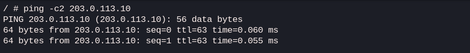

# Lab 04: NAT (Network Address Translation)

## Goal
The goal of this lab is to configure and understand **Source NAT (Masquerade)**. I'll demonstrate how a router can translate private internal IP addresses to a public external IP address, allowing multiple devices on a private network to share a single public IP for internet access.

## Topology
**PC-Internal** (192.168.1.10) --- **eth1-Router1-eth2** --- **PC-Internet** (203.0.113.10)

## Concepts
- **Private vs. Public IP space:** RFC 1918 addresses (private) vs. routable public addresses.
- **Source NAT (SNAT):** Changing the source IP of a packet as it passes through the router.
- **Masquerade:** A special form of SNAT used when the external IP is dynamic or to simplify configuration.
- **Iptables:** The Linux tool used to manage NAT rules on the router.

## IP plan
| Node | Interface | IP Address | Gateway |
| :--- | :--- | :--- | :--- |
| **PC-Internal** | eth1 | 192.168.1.10/24 | 192.168.1.1 |
| **Router1** | eth1 | 192.168.1.1/24 | N/A |
| **Router1** | eth2 | 203.0.113.1/24 | N/A |
| **PC-Internet** | eth1 | 203.0.113.10/24 | 203.0.113.1 |

## Configuration
In this lab, the NAT rule is applied on **Router1** using `iptables`:
```bash
iptables -t nat -A POSTROUTING -o eth2 -j MASQUERADE
```
This command tells the router to replace the source IP of any packet leaving through `eth2` (the 'internet' side) with the IP of `eth2` itself.


## Verification
1. **Connectivity test:** From **PC-Internal**, ping the external server: `ping 203.0.113.10`
2. **Observe NAT in action:** On **PC-Internet**, use `tcpdump` to see the source IP of incoming packets: `tcpdump -i eth1 icmp`
   - *Expectation:* Even though **PC-Internal** (192.168.1.10) is pinging, **PC-Internet** should see the source IP as **203.0.113.1** (Router1's external IP).

## Verification results
I executed the verification steps and the results confirm that NAT is working correctly:

**Ping from PC-Internal:**
```bash
/ # ping -c2 203.0.113.10
PING 203.0.113.10 (203.0.113.10): 56 data bytes
64 bytes from 203.0.113.10: seq=0 ttl=63 time=0.063 ms
64 bytes from 203.0.113.10: seq=1 ttl=63 time=0.050 ms
```


**Traffic capture on PC-Internet:**
```bash
/ # tcpdump -i eth1 icmp
08:17:17.733225 IP 203.0.113.1 > 203.0.113.10: ICMP echo request, id 10, seq 0, length 64
08:17:18.733361 IP 203.0.113.1 > 203.0.113.10: ICMP echo request, id 10, seq 1, length 64
```


As shown above, the `tcpdump` output proves that the packets arriving at the destination have the source IP **203.0.113.1** (the router), even though they originated from the internal network. This confirms the MASQUERADE rule is active.

Since this is an Alpine linux container, before running tcpdump command, we need to install it first:
```bash
/ # apk add tcpdump
```

---

### Notes

#### Why Linux commands instead of FRR?
Since this lab uses FRRouting on a Linux base, it's important to understand the split of responsibilities:
- **`sysctl -w net.ipv4.ip_forward=1`**: This is a "switch" in the Linux kernel. Without this, Linux acts like a normal PC and drops packets not meant for it. Enabling this makes the kernel behave like a router, forwarding packets between interfaces.
- **`iptables -t nat ...`**: FRR manages the routing table but doesn't handle NAT natively yet. I use the built-in Linux firewall (**Netfilter/iptables**) to intercept packets leaving the kernel and translate their IP addresses.

**Comparison with enterprise routers (e.g., Cisco):**
In hardware routers, these functions are integrated. On a Cisco router, I would use `ip nat inside source list...` directly in the router CLI. In a Linux/FRR environment, FRR handles the "where to send" (Control plane), while the Linux Kernel handles the "how to forward and translate" (Data plane).

#### Persistence
The `sysctl -w` command only changes the setting for the current session. To enable persistence on distributions like Fedora/CentOS, create a custom configuration file:

```bash
echo "net.ipv4.ip_forward=1" | sudo tee /etc/sysctl.d/99-routing.conf
sudo sysctl -p /etc/sysctl.d/99-routing.conf
```