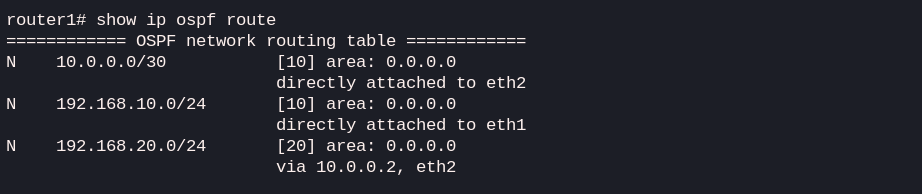
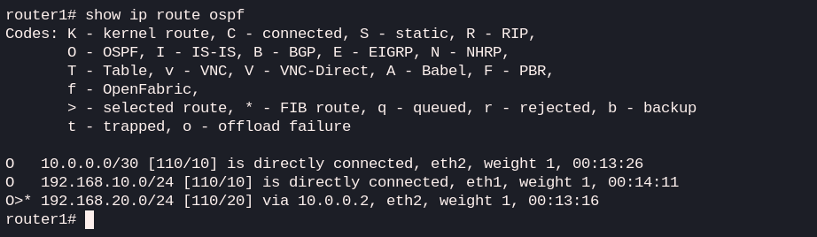
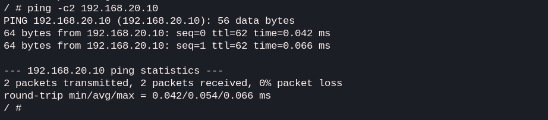

# Lab 05: OSPF Simple

## Goal
The goal of this lab is to configure and understand **OSPFv2 (Open Shortest Path First)**, a dynamic routing protocol. I'll demonstrate how two routers can automatically discover neighbors and exchange routing information without the need for manual static routes.

## Topology
**PC1** (192.168.10.10) --- **R1** (10.0.0.1) --- **R2** (10.0.0.2) --- **PC2** (192.168.20.10)

## Concepts
- **Dynamic Routing Protocols:** Protocols that automate the exchange of routing information.
- **OSPF Areas:** Logical grouping of routers (Area 0 is the backbone).
- **Router ID:** A unique identifier for each router in the OSPF process.
- **Adjacency:** The process of routers becoming "neighbors" and syncing databases.
- **Link-State Advertisements (LSA):** Packets used to share topology info.

## IP plan
| Node | Interface | IP Address | Gateway |
| :--- | :--- | :--- | :--- |
| **PC1** | eth1 | 192.168.10.10/24 | 192.168.10.1 |
| **Router1** | eth1 | 192.168.10.1/24 | N/A |
| **Router1** | eth2 | 10.0.0.1/30 | N/A |
| **Router2** | eth1 | 10.0.0.2/30 | N/A |
| **Router2** | eth2 | 192.168.20.1/24 | N/A |
| **PC2** | eth1 | 192.168.20.10/24 | 192.168.20.1 |

## Verification
1. **Connectivity test:** From **PC1**, ping **PC2**: `ping 192.168.20.10`
2. **Check OSPF Neighbors:** On **Router1**, verify that it sees **Router2** as a neighbor: `show ip ospf neighbor`
3. **Inspect Routing Table:** On **Router1**, look for routes learned via OSPF (noted with 'O'): `show ip route`
4. **Database Check:** View the OSPF link-state database: `show ip ospf database`

## Verification results
After deploying the lab, let's verify the OSPF adjacency and routing information on **Router1**.

**1. OSPF Neighbor status:**
Then check if the routers successfully formed an adjacency. The state **Full/DR** confirms that the synchronization is complete.


```bash
router1# show ip ospf neighbor 
Neighbor ID     Pri State           Up Time         Dead Time Address         Interface                        RXmtL RqstL DBsmL
2.2.2.2           1 Full/DR         4m48s             36.685s 10.0.0.2        eth2:10.0.0.1                        0     0     0
```

**2. Routing table analysis:**
The `show ip route ospf` command shows that Router1 has learned the network **192.168.20.0/24** (where PC2 is located) via OSPF (indicated by the `O` symbol).


```bash
router1# show ip route ospf 
O>* 192.168.20.0/24 [110/20] via 10.0.0.2, eth2, weight 1, 00:05:52
```

**3. End-to-end connectivity:**
Finally, a ping from **PC1** to **PC2** confirms that packets are being correctly routed through the OSPF-enabled network.


```bash
/ # ping 192.168.20.10
PING 192.168.20.10 (192.168.20.10): 56 data bytes
64 bytes from 192.168.20.10: seq=0 ttl=62 time=0.096 ms
64 bytes from 192.168.20.10: seq=1 ttl=62 time=0.051 ms
```
