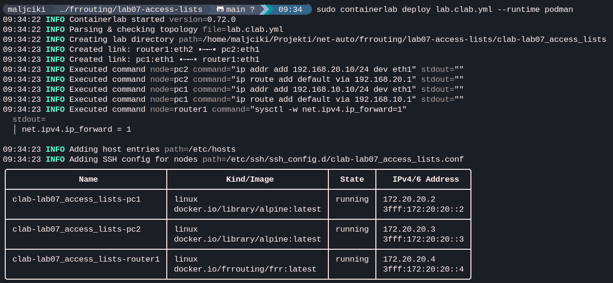
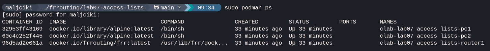
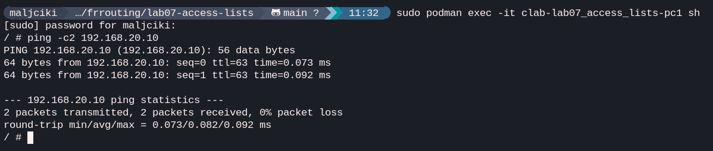
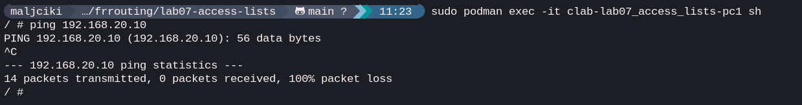
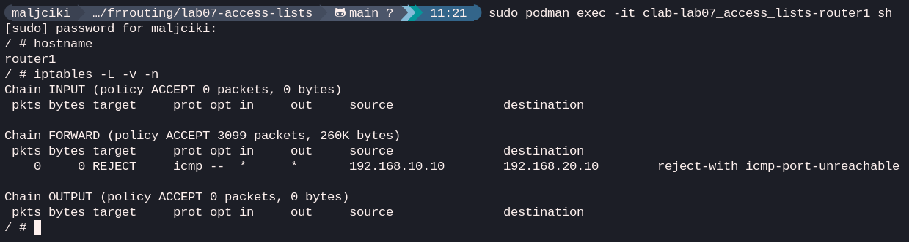

# Lab 07: Access Control Lists (ACL) / Firewall

## Goal
The goal of this lab is to implement network security using **Access Control Lists (ACLs)** or Linux **iptables**. I'll demonstrate how to filter traffic passing through a router based on source IP, destination IP, and protocol, effectively turning the router into a basic firewall.

## Topology
**PC1** (192.168.10.10) --- **Router1** --- **PC2** (192.168.20.10)

## Concepts
- **Traffic Filtering:** Allowing or denying packets based on specific criteria.
- **Inbound vs. Outbound rules:** Where to apply the filter.
- **Stateless vs. Stateful:** Iptables can track connection states, making it more advanced than simple ACLs.
- **Permit/Deny logic:** Most filters work on a "match and action" principle.

## IP plan
| Node | Interface | IP Address | Gateway |
| :--- | :--- | :--- | :--- |
| **PC1** | eth1 | 192.168.10.10/24 | 192.168.10.1 |
| **Router1** | eth1 | 192.168.10.1/24 | N/A |
| **Router1** | eth2 | 192.168.20.1/24 | N/A |
| **PC2** | eth1 | 192.168.20.10/24 | 192.168.20.1 |

## Configuration
In this lab, we use Linux `iptables` on **Router1** to simulate enterprise ACLs.

### Task 1: Block ICMP (Ping)
To block only ping traffic from PC1 to PC2:
```bash
iptables -A FORWARD -s 192.168.10.10 -d 192.168.20.10 -p icmp -j REJECT
```

## Verification
1. **Initial test:** Verify that PC1 can ping PC2 *before* applying the rule.
2. **Apply filter:** Run the `iptables` command on **Router1**.
3. **Verify block:** Attempt to ping again from **PC1**. It should now fail with "Destination Port Unreachable" or similar.
4. **Inspect rules:** On **Router1**, check the active filter table: `iptables -L -v -n`

## Verification results

### 1. Lab Deployment
Start the lab using `sudo containerlab command`. The deployment was successful, and all nodes were created correctly.



Then verification that all containers are running using `podman ps`:



### 2. Initial Connectivity Check
Before applying any firewall rules, verify **PC1** could successfully ping **PC2**. This confirms that routing is working correctly.



### 3. Applying and Verifying ACL (iptables)
After applying the `iptables` rule on **Router1** to block ICMP traffic from **PC1** to **PC2**, the traffic should be rejected. That is happening:



### 4. Inspecting Firewall Rules
Finally, checking the active rules on **Router1** to confirm the rule was correctly added to the `FORWARD` chain.


